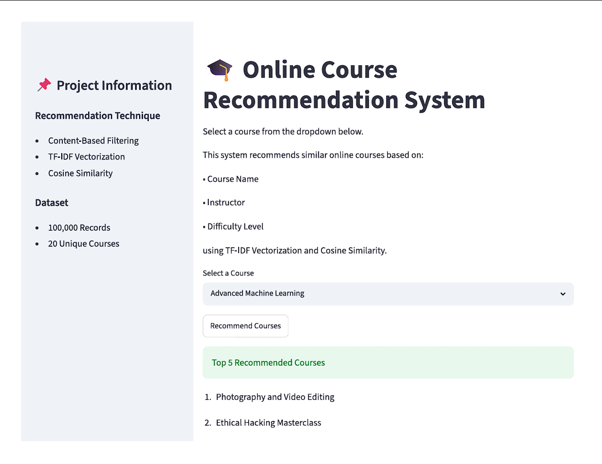

# 🎓 Online Course Recommendation System

An intelligent recommendation system that suggests relevant online courses using Content-Based Filtering and Collaborative Filtering.

The project combines exploratory data analysis, feature engineering, recommendation algorithms, and Streamlit deployment to help learners discover suitable courses.

---

## 📌 Problem Statement

Online learning platforms offer a large number of courses across different domains. Finding the right course based on a learner's interests, previous learning history, and engagement can be difficult.

This project aims to provide personalized course recommendations using learner-course interaction data and course characteristics.

---

## 🎯 Objectives

- Analyze learner-course interaction data
- Understand learner preferences through Exploratory Data Analysis
- Build a Content-Based Recommendation System
- Build a Collaborative Filtering Recommendation System
- Perform feature engineering
- Deploy the recommendation system using Streamlit

---

## 📊 Dataset

The dataset contains:

| Metric | Value |
|---|---:|
| Total Records | 100,000 |
| Features | 14 |
| Users | 43,242 |
| Courses | 20 |

### Key Features

- User ID
- Course ID
- Course Name
- Instructor
- Difficulty Level
- Rating
- Course Price
- Enrollment Numbers
- Feedback Score
- Certification Offered
- Study Material Available
- Time Spent
- Previous Courses Taken

---

## 🔍 Data Analysis

The project includes:

- Data type verification
- Missing value analysis
- Duplicate detection
- Statistical analysis
- Cardinality analysis
- Outlier analysis
- Course enrollment analysis
- Difficulty-level distribution
- Certification analysis
- Rating distribution
- Course price distribution
- Correlation analysis
- Rating vs. feedback analysis

### Key Findings

- Beginner courses form the largest portion of the dataset.
- Most courses provide certification.
- Course ratings are generally high.
- Technical and professional courses both show demand.
- Course prices are distributed across different price ranges.

---

## ⚙️ Feature Engineering

Several features were prepared for recommendation modeling.

### Encoded Features

Categorical values such as:

- Certification Offered
- Study Material Available
- Difficulty Level

were converted into numerical representations.

### Engagement Score

An engagement score was created using time spent relative to course duration.

### Popularity Score

A popularity score was created using:

- Rating
- Feedback Score
- Enrollment Numbers

---

## 🤖 Recommendation Models

### 1. Content-Based Filtering

The content-based model recommends courses based on course characteristics.

Course information such as:

- Course Name
- Instructor
- Difficulty Level

was combined into course-content text.

TF-IDF Vectorization was then used to convert the text into numerical vectors.

Cosine Similarity was used to measure similarity between courses.

**Process:**

Course Features  
↓  
Course Content  
↓  
TF-IDF  
↓  
Cosine Similarity  
↓  
Top Similar Courses

---

### 2. Collaborative Filtering

The collaborative filtering model uses learner-course ratings.

A User-Course Matrix was created where:

- Rows represent users
- Columns represent courses
- Values represent ratings

Missing ratings were replaced with zero and cosine similarity was used to identify users with similar preferences.

Recommendations were then generated based on courses preferred by similar users.

---

## 🚀 Streamlit Deployment

The recommendation system was deployed using Streamlit.

Users can:

1. Select a course
2. Click "Recommend Courses"
3. View the top 5 recommended courses

### Screenshot



---

## 🛠️ Technologies Used

- Python
- Pandas
- NumPy
- Matplotlib
- Seaborn
- Scikit-learn
- TF-IDF
- Cosine Similarity
- Streamlit
- Jupyter Notebook
- Pickle

---

## 📂 Project Structure

```text
Online-Course-Recommendation-System/
│
├── Dataset/
│   └── online_course_recommendation_v2.xlsx
│
├── Deployment/
│   └── app.py
│
├── Images/
│   ├── EDA images
│   ├── Feature Engineering
│   ├── Recommendation Results
│   └── Deployment Screenshot
│
├── Model-Files/
│   ├── course_df.pkl
│   ├── cosine_sim.pkl
│   └── course_indices.pkl
│
├── Notebook/
│   └── Online_Course_Recommendation.ipynb
│
├── Reports/
│   └── Project Documentation
│
├── .gitignore
├── README.md
└── requirements.txt
